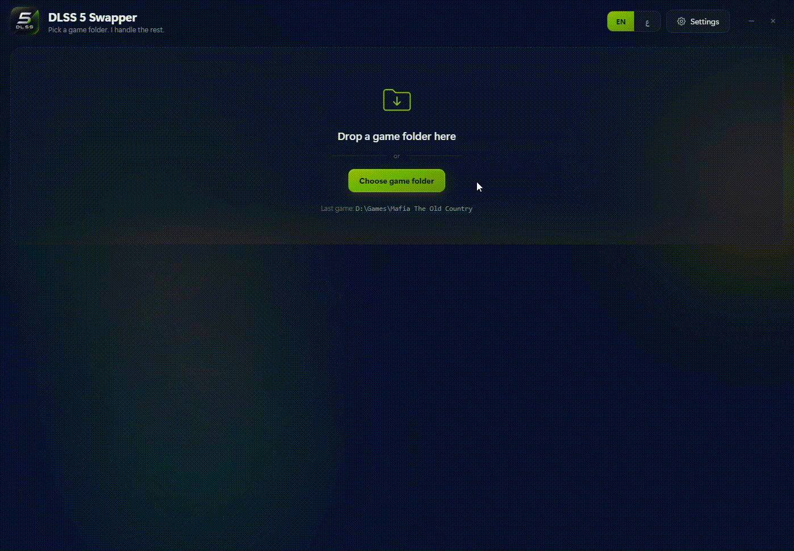
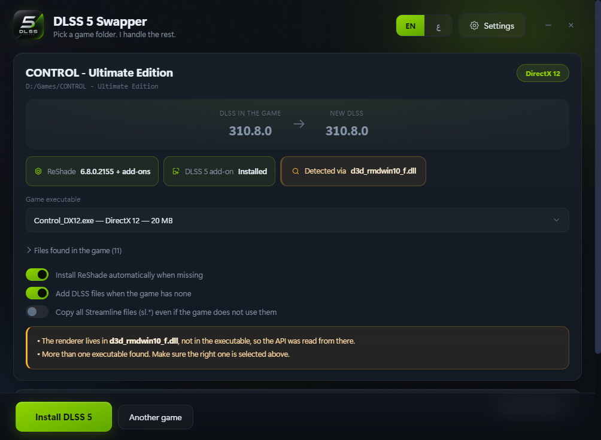
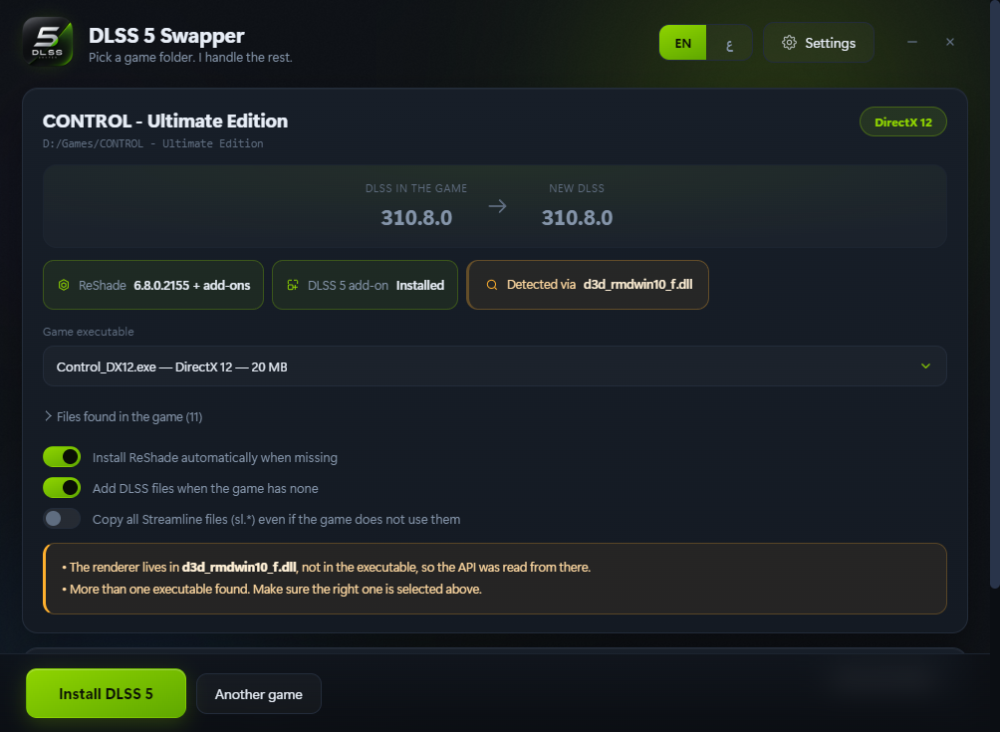
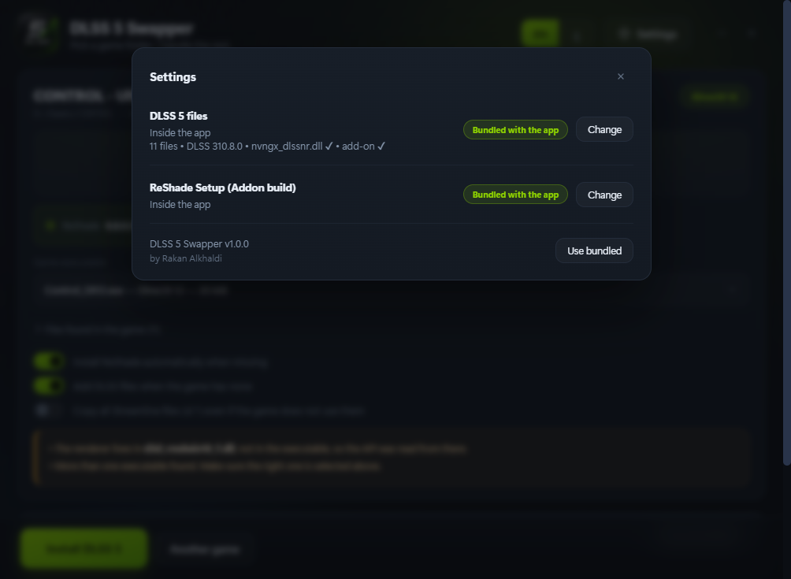
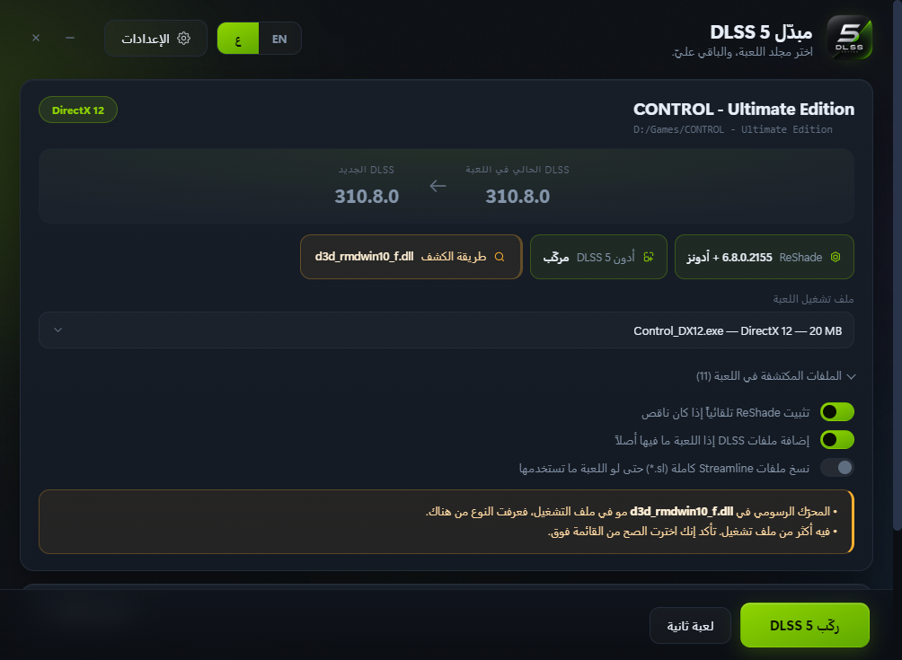
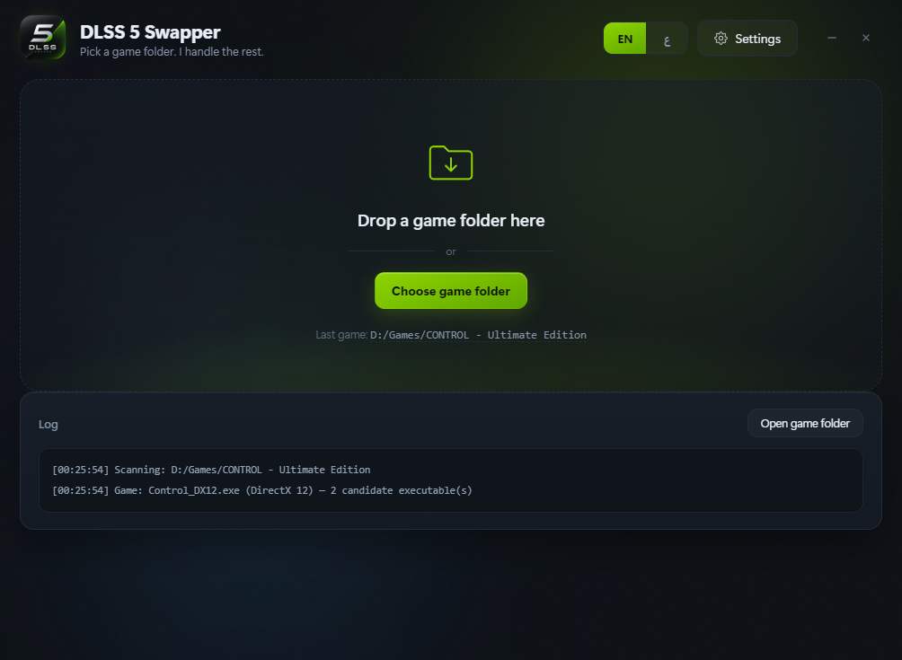

<p align="center">
  
</p>

<h1 align="center">DLSS 5 Swapper</h1>

<p align="center">
  Install DLSS 5 (Neural Rendering) into a DirectX 12 game in one click.
</p>

<p align="center">
  <a href="../../releases/latest"></a>
  <a href="../../releases"></a>
  
  
</p>

---


Point it at a game folder and it works out the rest: which file is the game,
which rendering API it uses, where the existing DLSS files are hiding, whether
ReShade is already there — then backs everything up, swaps the DLLs, drops the
RenoDX add-on in the right place and installs ReShade silently.

Everything ships inside the download. No extra files, no setup, no internet.

<p align="center">
  
</p>

## Download

Grab either one from the [**Releases**](../../releases) page:

| | Size | |
| --- | --- | --- |
| **DLSS5-Swapper-Setup-1.0.0.exe** | 213 MB | Installer — start menu and desktop shortcuts, clean uninstall |
| **DLSS5-Swapper-1.0.0-portable.exe** | 213 MB | Single file, no installation |

Windows 10/11 64-bit and an NVIDIA RTX card. Nothing else to install.

> The builds are not code-signed, so SmartScreen shows
> *"Windows protected your PC"* the first time. Click **More info → Run anyway**.

---

## What it does



**1. Finds the game.** Reads the import table (and the delay-load table) of
every `.exe`, which separates the game from its launcher and reveals the
rendering API. Two fallbacks cover the awkward cases:

- a protected build resolves Direct3D with `LoadLibrary` and imports nothing
  graphical, so the entry-point names left inside the binary
  (`D3D12CreateDevice`) are read instead — *GTA V Enhanced*;
- an engine that keeps its renderer in a separate DLL is followed one level
  deep into the game's own modules — *Control* (`d3d_rmdwin10_f.dll`), Unity
  titles (`UnityPlayer.dll`).

Folders that turn out to be installers rather than installed games are named as
such instead of failing with a shrug.

**2. Upgrades every DLSS and Streamline DLL where it already lives** — including
the ones Unreal buries under `Engine\Binaries\ThirdParty\NVIDIA\NGX\Win64`.
Files already at the target version are skipped, and folders named `backup`,
`old` or `original` are left alone.

**3. Puts the add-on where it can actually load.** `renodx-dlss5.addon64` and
`nvngx_dlssnr.dll` go next to the executable — the add-on refuses to start
without the neural-rendering runtime beside it.

**4. Installs ReShade silently** and verifies the installed DLL really carries
the add-on loader. If the game already runs ReShade as a `.asi` through an ASI
loader (GTA V with NaturalVision Enhanced), no `dxgi.dll` is added — that would
give the game two ReShades at once. The `.asi` is upgraded in place instead.

**5. Backs up everything first.** Originals go to `_DLSS5_Backup/` with a
manifest. **Restore originals** puts every file back, removes what was added,
and deletes ReShade only if this app installed it.



## Everything is bundled

The DLSS 5 files, the RenoDX add-on and the ReShade Addon installer all live
inside the executable. The app makes no network requests of any kind.



## English and Arabic

Switch at any time — the interface flips between left-to-right and
right-to-left, and even the log that is already on screen is re-translated,
because every step is recorded as an event code rather than a sentence.





---

## Notes

- Plain ReShade **cannot** load add-ons — the `_Addon` build is required. The
  app detects the difference by looking for the add-on loader inside the binary,
  because the version resource is identical in both builds.
- The DLSS 5 add-on is DirectX 12 only; anything else gets a warning.
- The add-on is built against **ReShade API 18**. If an older ReShade is already
  installed, an "update in place" option appears.
- A game under `Program Files` needs the app run as administrator. That is
  checked before anything is modified.

## Building from source

```
npm install
npm run icon        # squares the artwork and builds build/icon.ico
npm run payload     # gathers the DLSS 5 files + ReShade Setup into payload/
npm run build       # installer + portable, into dist/
```

`npm run payload` looks for the DLSS 5 files in the parent folder and for
`ReShade_Setup_*_Addon.exe` in Downloads/Desktop. To point it elsewhere:

```
npm run payload -- "C:\path\to\dlss 5 files"
```

### Layout

| File | Role |
| --- | --- |
| `src/core/pe.js` | PE reader: imports, delay imports, file version, byte-marker search |
| `src/core/scan.js` | Game and payload scanning, API detection, ReShade detection |
| `src/core/apply.js` | Backup, swap, ReShade install/upgrade, restore |
| `src/renderer/i18n.js` | Every user-facing string, both languages |
| `src/renderer/` | Interface, RTL/LTR aware |
| `scripts/` | Payload collection and icon generation |
| `main.js` | Windows, IPC, settings, payload resolution |

The core modules never produce prose. Each step reports a `{code, params}`
event and the renderer decides the wording — which is why switching language
also re-translates the log already on screen.

---

## بالعربي

برنامج يركّب **DLSS 5** على ألعاب DirectX 12 بضغطة واحدة.

تختار مجلد اللعبة، وهو يتكفّل بالباقي: يحدد ملف التشغيل الصحيح ويميّزه عن
اللانشر، يعرف نوع الـAPI، يدوّر على ملفات DLSS القديمة مهما كانت مدفونة في
مجلدات فرعية، ياخذ نسخة احتياطية من كل شي، يبدّل الملفات، يحط الأدون بجانب ملف
التشغيل، ويثبّت ReShade بصمت.

**كل الملفات مدمجة داخل البرنامج** — ما يحتاج تحميل أي شي، ولا يتصل بالإنترنت.

زر **رجّع الأصلي** يرجّع كل ملف لمكانه ويحذف اللي أضافه.

الواجهة عربية وإنجليزية، تبدّل بينهم في أي وقت.

---

Built by **Rakan Alkhaldi** · MIT licensed
