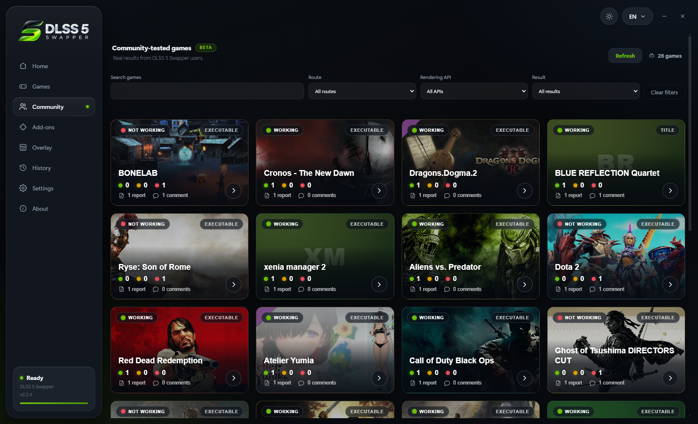
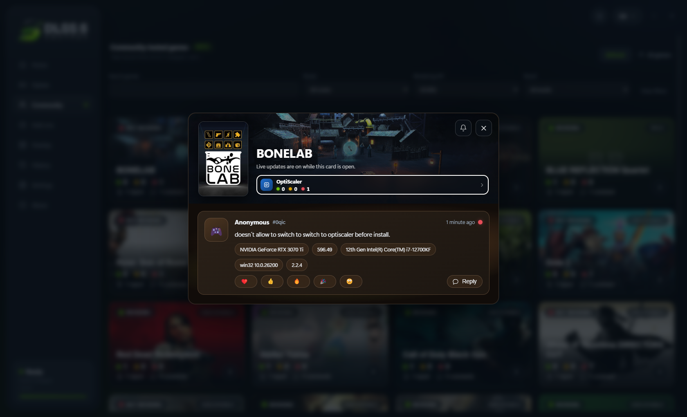
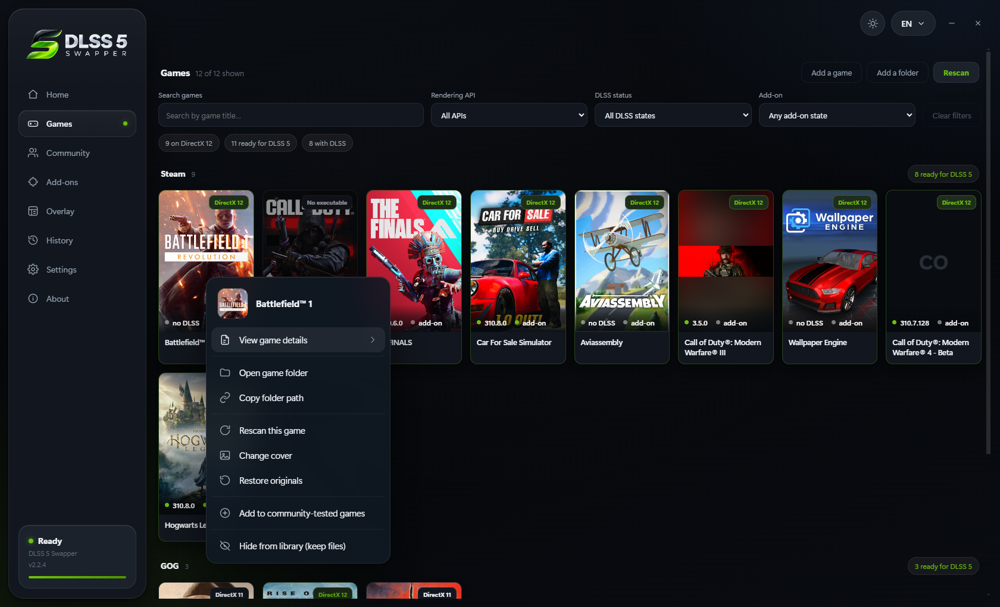
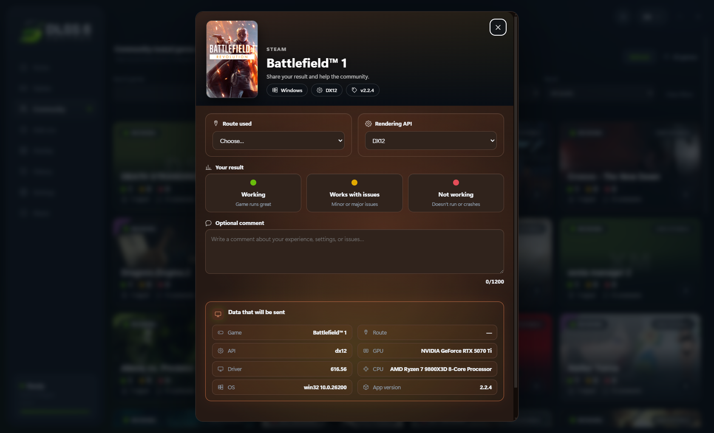
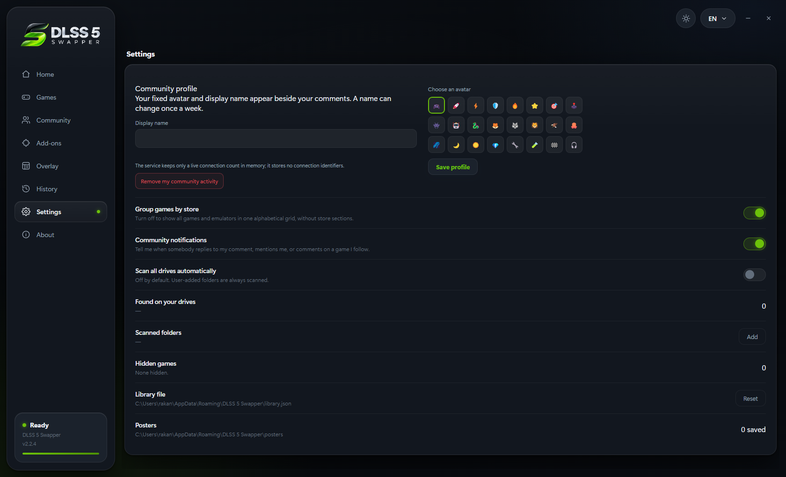

# DLSS 5 Swapper v2.2.4 — the Community page

A place to compare notes with other people, and eight faults fixed at the cause.

### The Community page — BETA

Compatibility is something other people already know, and until now every one of
them had to find out alone.

- **What other people found, on the games you own** - the route they used, the
  rendering API, whether it worked, and the machine it worked on.
- **A thread under any result**, with reactions, replies, and `@` mentions
  limited to the people already on that game. Windows tells you when someone
  answers or names you; a game's general comments stay quiet unless you ring
  its bell, and all of it can be switched off in Settings.

- **What you wrote stays yours.** Right-click a game in Games or Community, or
  use the buttons inside a comment, to edit or delete your own report and
  replies. Delete the last report on a game and the game leaves the list with it.

- **Every card is lit by the game's own artwork** - poster and banner together
  decide its colour, and the change is animated rather than switched.
- **Nothing leaves your machine unasked.** A report is filled in and sent by
  hand, with every field shown first.

- **Signed with a name you choose** - a display name and one of twenty-four
  icons drawn in the app, so they take their colour from your theme.
  **Remove my community activity** withdraws everything you ever left.

### And eight things that were wrong

| | |
|---|---|
| **Xbox games** | Found from `.GamingRoot` and Gaming Services instead of an all-drive scan, and the overlay installs into protected executables. Thanks to @BillyMRX1 ([#204], [#206]) |
| **Cyberpunk 2077** | Windows' own `dbghelp`/`dbgcore` no longer read as a rival mod loader, so OptiScaler installs ([#196]) |
| **Antivirus** | The overlay page names the add-on Defender took, instead of waiting forever for a game that can never attach ([#197]) |
| **Portable build** | Unpacks to `%TEMP%\DLSS5-Swapper`, one path an exclusion can keep across releases ([#197]) |
| **Skipped overlay** | The install log says why in words rather than a bare code ([#197]) |
| **Update check** | A check that could not run says so; only silence now means you are current ([#207]) |
| **Overlay panel** | Drag its bottom-right corner to resize, 0.75x to 2.5x, remembered per game ([#202]) |
| **dgVoodoo** | 4096 MB of emulated video memory, measured by @tomkolp as what SWTOR needs at 1440p ([#37]) |

[Full 2.2.4 notes →](https://github.com/rakanki911/DLSS5-Swapper/releases/tag/v2.2.4)

[#37]: https://github.com/rakanki911/DLSS5-Swapper/issues/37
[#196]: https://github.com/rakanki911/DLSS5-Swapper/issues/196
[#197]: https://github.com/rakanki911/DLSS5-Swapper/issues/197
[#202]: https://github.com/rakanki911/DLSS5-Swapper/issues/202
[#204]: https://github.com/rakanki911/DLSS5-Swapper/pull/204
[#206]: https://github.com/rakanki911/DLSS5-Swapper/pull/206
[#207]: https://github.com/rakanki911/DLSS5-Swapper/issues/207
